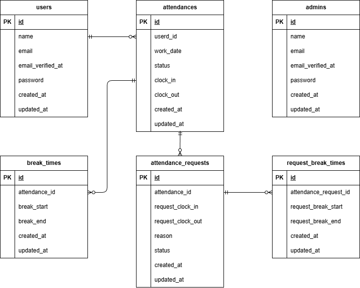

# 環境構築

## Dockerビルド
- https://github.com/days1024/attendance-management.git
- docker-compose up -d --build

## Laravel環境構築
- docker-compose exec php bash
- composer install
- cp .env.example .env ,環境変数を適宜変更
- php artisan key:generate
- php artisan migrate --seed
- （または php artisan migrate:fresh --seed）

## メール設定

以下を .env に設定してください

- MAIL_FROM_ADDRESS=your_email@example.com
- MAIL_FROM_NAME="Your App Name"

## 開発環境
- 勤怠登録画面（一般ユーザー）: http://localhost/attendance
- 会員登録画面（一般ユーザー）  http://localhost/register
- ログイン画面（一般ユーザー） http://localhost/login
- 勤怠一覧画面（一般ユーザー）: http://localhost//attendance/list
- 勤怠詳細画面（一般ユーザー）: http://localhost/attendance/detail/{id}
- 申請一覧画面（一般ユーザー）: http://localhost//stamp_correction_request/list
- ログイン画面（管理者）: http://localhost//admin/login
- 勤怠一覧画面（管理者）: http://localhost/admin/attendance/list
- 勤怠詳細画面（管理者）: http://localhost/mypage/profile
- スタッフ一覧画面（管理者）: admin/attendance/{id}
- スタッフ別勤怠一覧画面（管理者）: /admin/staff/list
- 申請一覧画面（管理者）: http://localhost/stamp_correction_request/list
- 修正申請承認画面（管理者）: http://localhost/stamp_correction_request/approve/{attendance_correct_request_id}
- phpMyAdmin: http://localhost:8080/

## 機能
-  メール認証機能(MailHogを使用)

##　ログイン情報
ログイン(一般ユーザー,管理者)は下記のいずれかでログインをお願いします。

----一般ユーザー----
- ユーザー名：テストユーザー1　メールアドレス：test1@example.com　パスワード：12341234
- ユーザー名：テストユーザー2　メールアドレス：test2@example.com　パスワード：12341234
- ユーザー名：テストユーザー3　メールアドレス：test3@example.com　パスワード：12341234
- ユーザー名：テストユーザー4　メールアドレス：test4@example.com　パスワード：12341234
- ユーザー名：テストユーザー5　メールアドレス：test5@example.com　パスワード：12341234

----管理者----
- ユーザー名：管理者　メールアドレス：admin@example.com　パスワード：password

※許可をもらってログイン情報を公開しております

## テスト（PHPUnit）/Laravelのテストは以下のコマンドでまとめて実行できます。

### 手順1:Laravel本体（src配下）へ移動し、テスト用環境ファイルを作成してください。
-  cp .env.example .env.testing

### 手順2:env.testingの設定を変更してください
- APP_KEY/DB設定/メール設定

### 手順3:テスト用データベースを作成してください
- CREATE DATABASE laravel_test;

### 手順4:テストを実行してください
-  php artisan test

# 使用技術

- PHP 8.1.34 (Docker)
- Composer 2.9.3
- Docker version 29.1.3
- MySQL 8.0.26
- nginx:1.21.1
- Laravel: 8.83.29

# ER図

